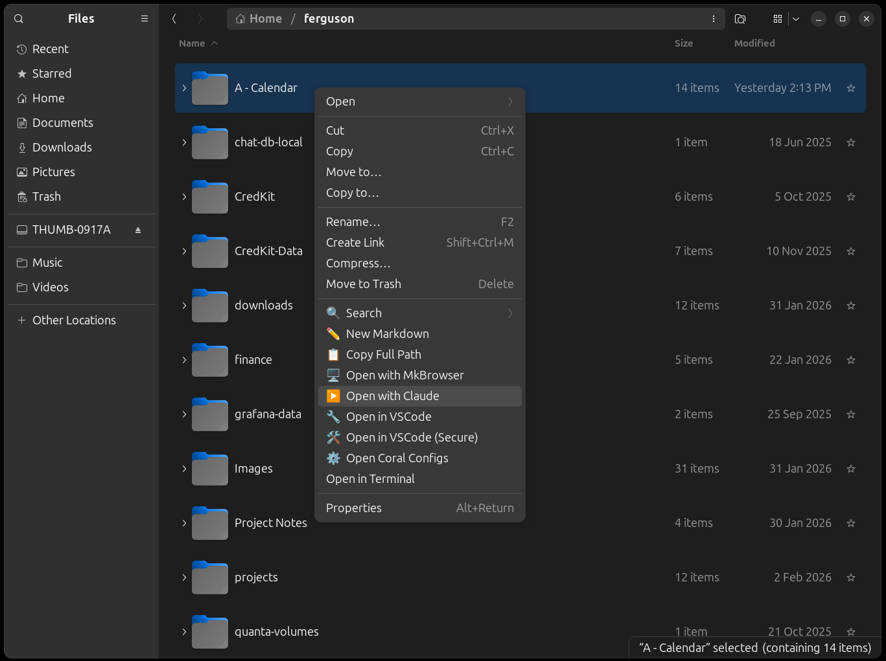
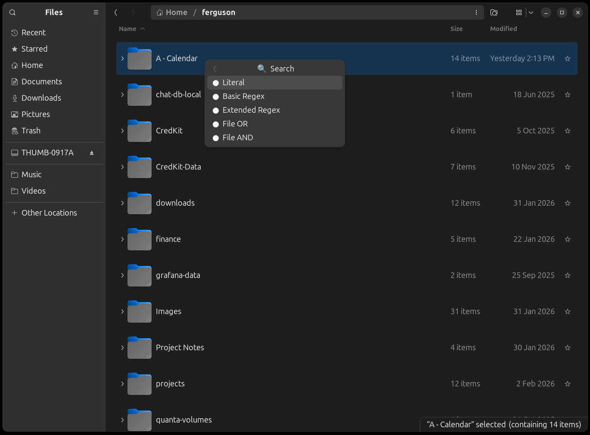

# Coral (Extends Nautilus Context Menu)

A developer-focused extension for Nautilus file manager that adds convenient context menu actions to streamline your workflow. Coral enhances Nautilus with productivity tools specifically designed for software developers.

Coral consists of four menu items added to the Nautilus right-click popup menu as shown in the image below: New Markdown, Search, Open in VSCode, and Run Script. The Coral Nautilus extension adds the ability to create a new markdown file in any folder using a single mouse click (a nice productivity aid), recursively search for text content across all files including PDFs, open VSCode projects with a single click, as well as the ability to run shell scripts with a single click. All of these tasks are very common for developers, and it's nice to have these embedded on a menu for a single click right inside Nautilus. 

Coral seamlessly integrates with Nautilus to provide quick access to common developer tasks directly from the file manager's context menu. No more switching between applications or remembering complex terminal commands - everything you need is just a right-click away.



## 🆕 New Markdown (Menu Item)
**Available:** Everywhere (right-click on files, folders, or empty space)

Creates a new timestamped Markdown file and automatically opens it in VS Code. Perfect for quick note-taking, documentation, or capturing ideas on the fly.

- **Smart placement:** File is created in the most logical location based on where you right-click
- **Friendly prompt:** Uses `zenity` to let you confirm or customize the filename before creation
- **Automatic timestamping:** Files are named with the current date and time (YYYY-MM-DD--HH-MM-SS format)
- **Instant editing:** Opens immediately in VS Code for seamless workflow

## 🔍 Search (Menu Item)
**Available:** On folders and empty space (searches current directory)



Recursively searches for text content within all files in a folder, including inside PDF files, **plus** searches for matching filenames and folder names. Results are displayed in an interactive zenity pick list where you can select files to open.

**Three Search Modes:**

The Search menu contains a submenu with three powerful search options:

1. **Literal** - Exact text matching with no special characters
   - Searches for the exact text you enter
   - Special characters like `.`, `*`, `|`, `?` are treated as literal text
   - Perfect for finding file paths, URLs, or text containing special symbols
   - Example: Searching for `file*.txt` finds that exact string, not a wildcard pattern

2. **Basic Regex** - Standard regular expression patterns
   - Uses grep's default (BRE) pattern matching
   - Supports `.` (any char), `*` (zero or more), `^` (start), `$` (end), `[...]` (character classes)
   - Great for flexible pattern matching with common wildcards
   - See [BASIC-REGEX-TIPS.md](docs/BASIC-REGEX-TIPS.md) for comprehensive examples and patterns

3. **Extended Regex** - Advanced regular expression patterns
   - Uses grep's extended mode (`-E`) for powerful searching
   - Supports `|` (OR), `+` (one or more), `?` (optional), `{n,m}` (repetition), `()` (grouping)
   - Perfect for complex searches like `error|warning|critical` or `https?://`
   - See [EXTENDED-REGEX-TIPS.md](docs/EXTENDED-REGEX-TIPS.md) for comprehensive examples and patterns

**Search Features:**

- **Comprehensive search:** Searches file content (using `grep` for regular files and `pdftotext` for PDFs) **and** searches filenames and folder names (using `find`)
- **Filename matching:** Always uses literal/case-insensitive matching for filenames and folder names, regardless of selected search mode
- **Interactive prompting:** Enter your search term via a friendly `zenity` dialog
- **Live feedback:** Terminal window shows search progress in real-time
- **Interactive results:** Results are displayed in a zenity GUI pick list for easy file selection
- **Persistent selection:** The pick list stays open so you can open multiple files without re-searching
- **Smart file opening:** Markdown and text files (`.md`, `.txt`) open in VS Code; other files open with your system's default application (e.g., PDFs open in your PDF viewer)
- **Case-insensitive:** All search modes ignore case for better matching
- **PDF support detection:** Automatically checks for `pdftotext` and provides installation instructions if needed
- **Configurable exclusions:** Exclude directories like `node_modules`, `.git`, build folders, etc. from searches
  - See [CONFIG.md](docs/CONFIG.md) for details on customizing search exclusions

**Note:** To enable PDF searching, install poppler-utils:
```bash
sudo apt install poppler-utils
```

## 📂 Open in VS Code (Menu Item)
**Available:** On folders, text files, and empty space

Launches Visual Studio Code with the selected item, making it effortless to jump into coding or editing tasks.

- **Folder support:** Opens entire directories as VS Code workspaces
- **Text file support:** Directly opens supported file types for editing
- **Smart detection:** Recognizes common developer file formats (.txt, .md, .py, .js, .html, .css, .json, .xml, .yml, .yaml, .ini, .cfg, .conf, and more)
- **Empty space option:** Opens the current directory when right-clicking on empty space

### ⚡ Run Script (Menu Item)
**Available:** On shell script files (.sh)

Executes shell scripts in a new terminal window, complete with proper directory context and user-friendly output.

- **New terminal window:** Scripts run in their own terminal for easy monitoring
- **Correct working directory:** Automatically sets the script's directory as the working directory
- **Interactive execution:** Terminal remains open after execution for reviewing output
- **User-friendly display:** Shows script name, directory, and completion status

Nautilus does already have the ability to run script files, but using this menu makes it much easier because it takes only a single click.

## 📜 Custom Scripts (YAML-Defined)
**Available:** On folders

Define your own custom scripts in the Coral configuration file, and they'll automatically appear as menu items! This powerful feature lets you run any shell command against a selected folder with a single click.

### How It Works

1. Open your Coral config file by right-clicking and selecting **Open Coral Configs**
2. Define scripts under the `scripts` key in the YAML
3. Each script gets its own menu item, appearing right after "Open in VSCode"
4. When you click a script menu item, it runs with `$OPEN_FOLDER` replaced by the selected folder path

### YAML Format

```yaml
scripts:
  - name: script-name
    content: |
      your shell commands here
      with $OPEN_FOLDER as the target folder
```

- **name**: The label that appears on the menu (keep it short and descriptive)
- **content**: The shell script to execute (use `|` for multiline scripts)
- **$OPEN_FOLDER**: This variable is automatically replaced with the selected folder path

### Example Configuration

```yaml
scripts:
  # Launch VS Code in a secure Firejail sandbox
  - name: vscode-sandbox
    content: |
      firejail --noprofile \
        --whitelist=~/.vscode \
        --whitelist=~/.config/Code \
        --whitelist=$OPEN_FOLDER \
        code $OPEN_FOLDER

  # Run a Node.js project
  - name: npm-start
    content: |
      cd $OPEN_FOLDER && npm start

  # Open a terminal in the folder
  - name: terminal
    content: |
      gnome-terminal --working-directory=$OPEN_FOLDER
```

With this configuration, you'll see three new menu items when right-clicking on folders:
- **● vscode-sandbox** - Opens VS Code in a sandboxed environment
- **● npm-start** - Runs `npm start` in the selected folder
- **● terminal** - Opens a new terminal window in that folder

### Use Cases

- **Security sandboxing:** Run applications with restricted file access using Firejail
- **Project launchers:** Start development servers, build processes, or test suites
- **Quick terminals:** Open terminals pre-configured with the right working directory
- **Custom tooling:** Run linters, formatters, or any CLI tools against a folder
- **Deployment scripts:** Trigger deployment or sync operations for specific projects

### Notes

- Scripts are executed via `bash -c`, so standard bash syntax applies
- The `$OPEN_FOLDER` path is automatically quoted to handle spaces and special characters
- Use backslashes (`\`) at the end of lines for readable multiline commands
- Scripts run in the background (non-blocking) so Nautilus remains responsive

## Installation

1. Run the setup script:
   ```bash
   ./setup.sh
   ```

2. Restart Nautilus:
   ```bash
   nautilus -q
   ```

3. Open a new Nautilus window and start using your new context menu options!

## Requirements

- Nautilus file manager
- Visual Studio Code
- Python 3 with Nautilus bindings (automatically installed by setup script)
- zenity (for graphical prompts)
- poppler-utils (optional, for PDF search support - install with `sudo apt install poppler-utils`)

