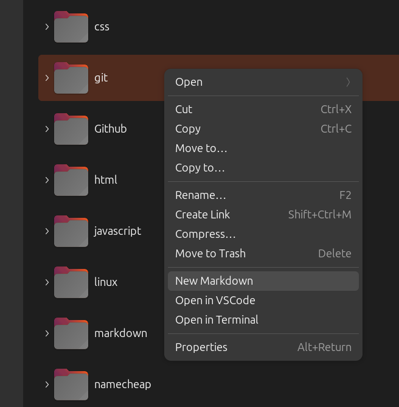

# Coral

A developer-focused extension for Nautilus file manager that adds convenient context menu actions to streamline your workflow. Coral enhances Nautilus with productivity tools specifically designed for software developers.

Coral consists of four menu items added to the Nautilus right-click popup menu as shown in the image below: New Markdown, Search, Open in VSCode, and Run Script. The Coral Nautilus extension adds the ability to create a new markdown file in any folder using a single mouse click (a nice productivity aid), recursively search for text content across all files including PDFs, open VSCode projects with a single click, as well as the ability to run shell scripts with a single click. All of these tasks are very common for developers, and it's nice to have these embedded on a menu for a single click right inside Nautilus. 



## Overview

Coral seamlessly integrates with Nautilus to provide quick access to common developer tasks directly from the file manager's context menu. No more switching between applications or remembering complex terminal commands - everything you need is just a right-click away.

## Features

### 🆕 New Markdown
**Available:** Everywhere (right-click on files, folders, or empty space)

Creates a new timestamped Markdown file and automatically opens it in VS Code. Perfect for quick note-taking, documentation, or capturing ideas on the fly.

- **Smart placement:** File is created in the most logical location based on where you right-click
- **Friendly prompt:** Uses `zenity` to let you confirm or customize the filename before creation
- **Automatic timestamping:** Files are named with the current date and time (YYYY-MM-DD--HH-MM-SS format)
- **Instant editing:** Opens immediately in VS Code for seamless workflow

### 🔍 Search
**Available:** On folders and empty space (searches current directory)

Recursively searches for text content within all files in a folder, including inside PDF files. Results are saved to a timestamped markdown file and opened in VS Code with clickable file links.

**Three Search Modes:**

The Search menu contains a submenu with three powerful search options:

1. **Literal** - Exact text matching with no special characters
   - Searches for the exact text you enter
   - Special characters like `.`, `*`, `|`, `?` are treated as literal text
   - Perfect for finding file paths, URLs, or text containing special symbols
   - Example: Searching for `file*.txt` finds that exact string, not a wildcard pattern

2. **Basic Regex** - Standard regular expression patterns
   - Uses grep's default (BRE) pattern matching
   - Supports `.` (any char), `*` (zero or more), `^` (start), `$` (end), `[...]` (character classes)
   - Great for flexible pattern matching with common wildcards
   - See [BASIC-REGEX-TIPS.md](BASIC-REGEX-TIPS.md) for comprehensive examples and patterns

3. **Extended Regex** - Advanced regular expression patterns
   - Uses grep's extended mode (`-E`) for powerful searching
   - Supports `|` (OR), `+` (one or more), `?` (optional), `{n,m}` (repetition), `()` (grouping)
   - Perfect for complex searches like `error|warning|critical` or `https?://`
   - See [EXTENDED-REGEX-TIPS.md](EXTENDED-REGEX-TIPS.md) for comprehensive examples and patterns

**Search Features:**

- **Powerful search:** Uses `grep` for regular files and `pdftotext` for PDF content
- **Interactive prompting:** Enter your search term via a friendly `zenity` dialog
- **Live feedback:** Terminal window shows search progress in real-time
- **Clickable results:** File paths are formatted as `file://` URLs that you can Ctrl+Click in VS Code to open
- **Persistent history:** Each search creates a timestamped file (e.g., `coral-search--2025-11-05--14-30-45.md`) in `/tmp/`
- **Chronological sorting:** Search result files are named to sort chronologically, making it easy to review past searches
- **Case-insensitive:** All search modes ignore case for better matching
- **PDF support detection:** Automatically checks for `pdftotext` and provides installation instructions if needed
- **Configurable exclusions:** Exclude directories like `node_modules`, `.git`, build folders, etc. from searches
  - See [CONFIG.md](CONFIG.md) for details on customizing search exclusions

**Note:** To enable PDF searching, install poppler-utils:
```bash
sudo apt install poppler-utils
```

### �📂 Open in VS Code
**Available:** On folders, text files, and empty space

Launches Visual Studio Code with the selected item, making it effortless to jump into coding or editing tasks.

- **Folder support:** Opens entire directories as VS Code workspaces
- **Text file support:** Directly opens supported file types for editing
- **Smart detection:** Recognizes common developer file formats (.txt, .md, .py, .js, .html, .css, .json, .xml, .yml, .yaml, .ini, .cfg, .conf, and more)
- **Empty space option:** Opens the current directory when right-clicking on empty space

### ⚡ Run Script
**Available:** On shell script files (.sh)

Executes shell scripts in a new terminal window, complete with proper directory context and user-friendly output.

- **New terminal window:** Scripts run in their own terminal for easy monitoring
- **Correct working directory:** Automatically sets the script's directory as the working directory
- **Interactive execution:** Terminal remains open after execution for reviewing output
- **User-friendly display:** Shows script name, directory, and completion status

Nautilus does already have the ability to run script files, but using this menu makes it much easier because it takes only a single click.

## Installation

1. Run the setup script:
   ```bash
   ./setup.sh
   ```

2. Restart Nautilus:
   ```bash
   nautilus -q
   ```

3. Open a new Nautilus window and start using your new context menu options!

## Usage Examples

### Creating Documentation
Right-click in any project folder and select "New Markdown" to instantly create timestamped documentation files. Perfect for meeting notes, feature specifications, or development logs.

### Finding Text Across Your Project
Right-click on any project folder, hover over "Search", and choose one of three search modes (Literal, Basic Regex, or Extended Regex) based on your needs. Enter your search term to find text content across all files, including inside PDFs. Watch the search progress in the terminal, then the results automatically open in VS Code with clickable file links. Search history is preserved in `/tmp/` with timestamped filenames for easy reference.

### Quick Code Editing
Right-click on any text file or folder and select "Open in VS Code" to jump straight into development without navigating through menus or typing terminal commands.

### Script Execution
Right-click on any shell script and select "Run Script" to execute it with full terminal output. Great for build scripts, deployment tools, or utility scripts.

## Smart Behaviors

- **Context-aware file creation:** New Markdown files are placed intelligently based on your selection
- **File type detection:** Automatically recognizes text files using both file extensions and MIME types
- **Developer-friendly formats:** Supports all common development file types out of the box

## Requirements

- Nautilus file manager
- Visual Studio Code
- Python 3 with Nautilus bindings (automatically installed by setup script)
- zenity (for graphical prompts)
- poppler-utils (optional, for PDF search support - install with `sudo apt install poppler-utils`)

## Why Coral?

Coral transforms Nautilus from a simple file browser into a developer's command center. By reducing friction between file management and development tasks, Coral helps you maintain focus and productivity throughout your coding sessions.

---

*Coral - Enhancing your oceanic file management experience* 🪸
