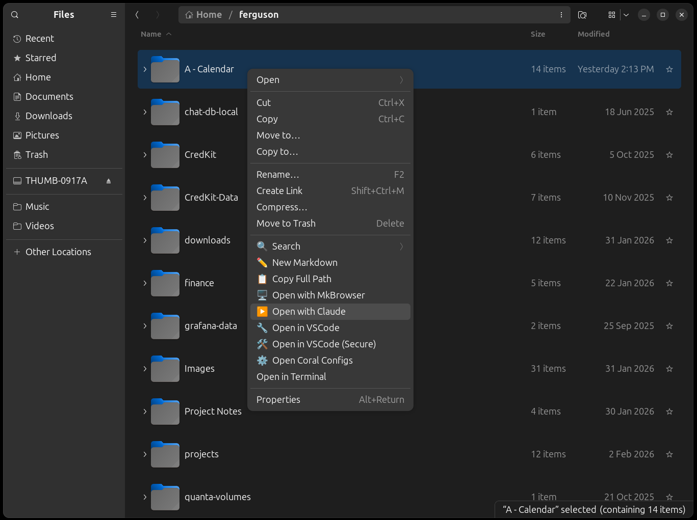

# Coral (Extends Nautilus Context Menu)


A developer-focused extension for Nautilus file manager that adds convenient context menu actions to streamline your workflow. Coral enhances Nautilus with productivity tools specifically designed for software developers.

Coral adds menu items to the Nautilus right-click popup menu as shown in the image below: New Markdown, Copy Full Path, Run Script, and Custom Scripts. The Coral Nautilus extension adds the ability to create a new markdown file in any folder using a single mouse click (a nice productivity aid), copy a file or folder's full path to the clipboard, run shell scripts with a single click, and run custom YAML-defined scripts against folders. All of these tasks are very common for developers, and it's nice to have these embedded on a menu for a single click right inside Nautilus. 

> **Looking for search?** Coral's recursive content search now lives in its own Nautilus extension, [SonarEx](../sonarex). Install it alongside Coral to get the **Search (Interactive)** and **Search (Static)** menu items back.

Coral seamlessly integrates with Nautilus to provide quick access to common developer tasks directly from the file manager's context menu. No more switching between applications or remembering complex terminal commands - everything you need is just a right-click away.



## 🆕 New Markdown (Menu Item)
**Available:** Everywhere (right-click on files, folders, or empty space)

Creates a new timestamped Markdown file and automatically opens it in VS Code. Perfect for quick note-taking, documentation, or capturing ideas on the fly.

- **Smart placement:** File is created in the most logical location based on where you right-click
- **Friendly prompt:** Uses `zenity` to let you confirm or customize the filename before creation
- **Automatic timestamping:** Files are named with the current date and time (YYYY-MM-DD--HH-MM-SS format)
- **Instant editing:** Opens immediately in VS Code for seamless workflow

## 📋 Copy Full Path (Menu Item)
**Available:** On files and folders

Copies the full filesystem path of the selected file or folder to the clipboard with a single click. No more manually navigating to the address bar or typing paths in a terminal.

- **Instant clipboard access:** Path is copied immediately when you click the menu item
- **Works on any selection:** Files, folders, and any other filesystem items
- **Full path:** Copies the complete absolute path (e.g., `/home/user/Documents/myfile.txt`)
- **Requires `xclip`:** Install it with:
  ```bash
  sudo apt install xclip
  ```

### ⚡ Run Script (Menu Item)

Executes shell scripts in a new terminal window, complete with proper directory context and user-friendly output.

- **New terminal window:** Scripts run in their own terminal for easy monitoring
- **Correct working directory:** Automatically sets the script's directory as the working directory
- **Interactive execution:** Terminal remains open after execution for reviewing output
- **User-friendly display:** Shows script name, directory, and completion status

Nautilus does already have the ability to run script files, but using this menu makes it much easier because it takes only a single click.

## 📜 Custom Scripts (YAML-Defined)
**Available:** On folders

Define your own custom scripts in the Coral configuration file, and they'll automatically appear as menu items! This powerful feature lets you run any shell command against a selected folder with a single click.

### How It Works

1. Open your Coral config file by right-clicking and selecting **Open Coral Configs**
2. Define scripts under the `scripts` key in the YAML
3. Each script gets its own menu item on the context menu
4. When you click a script menu item, it runs with `$OPEN_FOLDER` replaced by the selected folder path

### YAML Format

```yaml
scripts:
  - name: script-name
    content: |
      your shell commands here
      with $OPEN_FOLDER as the target folder
```

- **name**: The label that appears on the menu (keep it short and descriptive)
- **content**: The shell script to execute (use `|` for multiline scripts)
- **$OPEN_FOLDER**: This variable is automatically replaced with the selected folder path

### Example Configuration

```yaml
scripts:
  # Open folder in VS Code
  - name: Open in VSCode
    content: |
      code $OPEN_FOLDER

  # Open a terminal in the folder
  - name: terminal
    content: |
      gnome-terminal --working-directory=$OPEN_FOLDER
```

With this configuration, you'll see three new menu items when right-clicking on folders:
- **● Open in VSCode** - Opens VS Code with the selected folder
- **● vscode-sandbox** - Opens VS Code in a sandboxed environment
- **● terminal** - Opens a new terminal window in that folder

### Use Cases

- **Security sandboxing:** Run applications with restricted file access using Firejail
- **Project launchers:** Start development servers, build processes, or test suites
- **Quick terminals:** Open terminals pre-configured with the right working directory
- **Custom tooling:** Run linters, formatters, or any CLI tools against a folder
- **Deployment scripts:** Trigger deployment or sync operations for specific projects

### Notes

- Scripts are executed via `bash -c`, so standard bash syntax applies
- The `$OPEN_FOLDER` path is automatically quoted to handle spaces and special characters
- Use backslashes (`\`) at the end of lines for readable multiline commands
- Scripts run in the background (non-blocking) so Nautilus remains responsive

### TTY/Interactive Apps (Claude Code Example)

Some CLI apps require a real TTY to initialize. In that case, launch them inside a terminal rather than running them directly. For example, Anthropic’s Claude Code app:

```yaml
scripts:
  - name: Open with Claude
    content: |
      gnome-terminal --working-directory="$OPEN_FOLDER" -- bash -lc "claude; exec bash"
```

This ensures the app runs with a TTY and opens in the selected folder.

## Installation

1. Run the setup script:
   ```bash
   ./setup.sh
   ```

2. Restart Nautilus:
   ```bash
   nautilus -q
   ```

3. Open a new Nautilus window and start using your new context menu options!

## Requirements

- Nautilus file manager
- Visual Studio Code
- Python 3 with Nautilus bindings (automatically installed by setup script)
- zenity (for graphical prompts)
- xclip (for clipboard support - install with `sudo apt install xclip`)

