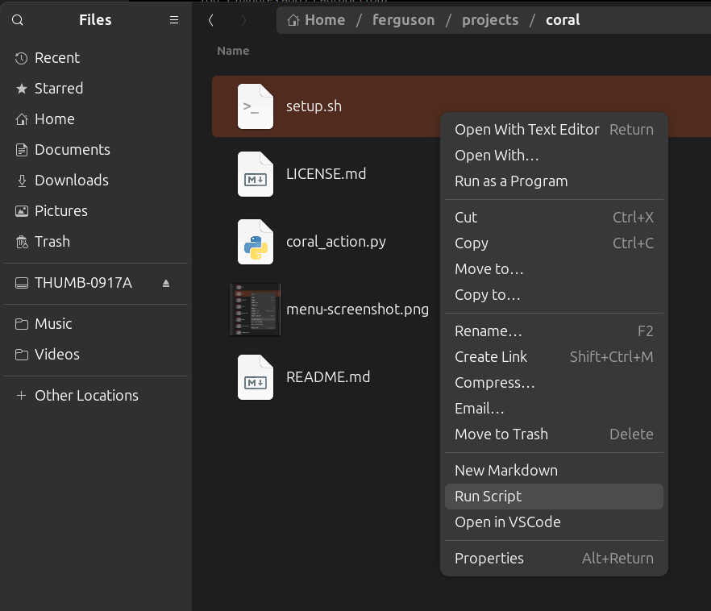

# Coral

A developer-focused extension for Nautilus file manager that adds convenient context menu actions to streamline your workflow. Coral enhances Nautilus with productivity tools specifically designed for software developers.

Coral consists only of the three menu items added to the Nautilus right-click popup menu as shown in the image below which are: New Markdown, Open in VSCode, and Open in Terminal.



## Overview

Coral seamlessly integrates with Nautilus to provide quick access to common developer tasks directly from the file manager's context menu. No more switching between applications or remembering complex terminal commands - everything you need is just a right-click away.

## Features

### 🆕 New Markdown
**Available:** Everywhere (right-click on files, folders, or empty space)

Creates a new timestamped Markdown file and automatically opens it in VS Code. Perfect for quick note-taking, documentation, or capturing ideas on the fly.

- **Smart placement:** File is created in the most logical location based on where you right-click
- **Friendly prompt:** Uses `zenity` to let you confirm or customize the filename before creation
- **Automatic timestamping:** Files are named with the current date and time (YYYY-MM-DD--HH-MM-SS format)
- **Instant editing:** Opens immediately in VS Code for seamless workflow

### 📂 Open in VS Code
**Available:** On folders, text files, and empty space

Launches Visual Studio Code with the selected item, making it effortless to jump into coding or editing tasks.

- **Folder support:** Opens entire directories as VS Code workspaces
- **Text file support:** Directly opens supported file types for editing
- **Smart detection:** Recognizes common developer file formats (.txt, .md, .py, .js, .html, .css, .json, .xml, .yml, .yaml, .ini, .cfg, .conf, and more)
- **Empty space option:** Opens the current directory when right-clicking on empty space

### ⚡ Run Script
**Available:** On shell script files (.sh)

Executes shell scripts in a new terminal window, complete with proper directory context and user-friendly output.

- **New terminal window:** Scripts run in their own terminal for easy monitoring
- **Correct working directory:** Automatically sets the script's directory as the working directory
- **Interactive execution:** Terminal remains open after execution for reviewing output
- **User-friendly display:** Shows script name, directory, and completion status

## Installation

1. Run the setup script:
   ```bash
   ./setup.sh
   ```

2. Restart Nautilus:
   ```bash
   nautilus -q
   ```

3. Open a new Nautilus window and start using your new context menu options!

## Usage Examples

### Creating Documentation
Right-click in any project folder and select "New Markdown" to instantly create timestamped documentation files. Perfect for meeting notes, feature specifications, or development logs.

### Quick Code Editing
Right-click on any text file or folder and select "Open in VS Code" to jump straight into development without navigating through menus or typing terminal commands.

### Script Execution
Right-click on any shell script and select "Run Script" to execute it with full terminal output. Great for build scripts, deployment tools, or utility scripts.

## Smart Behaviors

- **Context-aware file creation:** New Markdown files are placed intelligently based on your selection
- **File type detection:** Automatically recognizes text files using both file extensions and MIME types
- **Developer-friendly formats:** Supports all common development file types out of the box

## Requirements

- Nautilus file manager
- Visual Studio Code
- Python 3 with Nautilus bindings (automatically installed by setup script)
- zenity (for graphical filename prompts)

## Why Coral?

Coral transforms Nautilus from a simple file browser into a developer's command center. By reducing friction between file management and development tasks, Coral helps you maintain focus and productivity throughout your coding sessions.

---

*Coral - Enhancing your oceanic file management experience* 🪸
